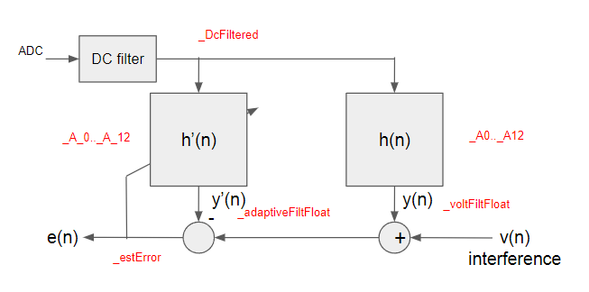

# Normalized Least Mean Square Adaptive FIR Filter

## Important note
Only CLA code is included in the project.

## Introduction
For a brief introduction, please refer to,
https://en.wikipedia.org/wiki/Least_mean_squares_filter

* The basic idea behind LMS filter is to approach the optimum filter weights, by updating the filter weights in a manner to converge to the optimum filter weight.
* This is based on the gradient descent algorithm.
* The algorithm starts by assuming small weights (zero in most cases) and, at each step, by finding the gradient of the mean square error, the weights are updated.
* The main drawback of the "pure" LMS algorithm is that it is sensitive to the scaling of its input.
* The Normalised Least Mean Squares filter (NLMS) is a variant of the LMS algorithm that solves this problem by normalising with the power of the input.

## Implementation

* Start with cla_adc_fir32 example code as a base
* Combine buffdac_sine_dma_cpu01 example code with the desired waveform in C table, so that the DAC generates simulated input signal
* Loopback DAC output into ADC input
* Define ‘unknown system’ model into a table
* Initialize CLA
* Configure ADC to start sampling on ePWM
* Start ePWM with desired frequency - 50KHz -> 20usec period
* Initialize adaptive filter state machine
* Start DMA, CPU timer and loop

## Theory of operation for CLA code

* Run a simple 1 tab DC removal filter - x(n)
* Apply a 13 tap FIR filter that simulates ‘unknown system h(n)’ to get input signal y(n)
* Apply a 13 tap FIR adaptive filter on x(n) to get estimate y’(n)
* Calculate variance - 𝚺 (x*x)
* Calculate correction factor, estimate error / (variance + eps)
* (y(n) - y’(n))/(𝚺 (x*x) + eps) is calculated using reciprocal approximation
* Update adaptive filter coefficients
* Flush the pipeline by waiting 3 instruction cycle then stop CLA

### Mapping for CLA variables

## Hardware :
- This project was tested on LAUNCHXL-F28379D.
- Testing the adaptive filter operation by looping back DAC output into ADC input. It requires ADC128S102EVM Booster Pack board with a jumper that could connect DAC B output directly to ADC INPUT when shorted.

## References :
- LAUNCHXL-F28379D User Guide
- TMS320F28379D Technical Reference
- ADC128S102EVM Booster Pack Users Guide

